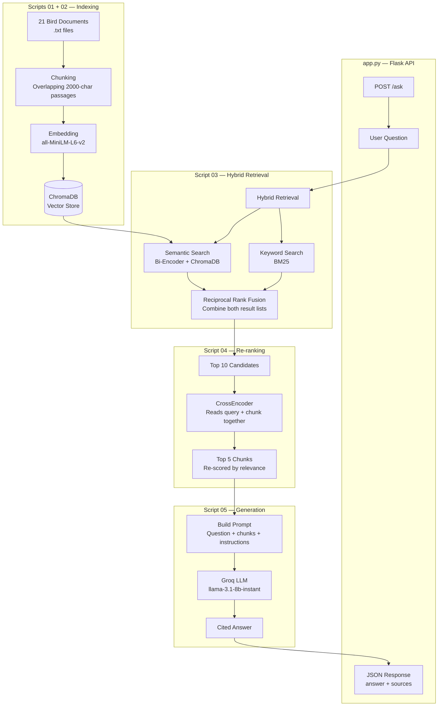
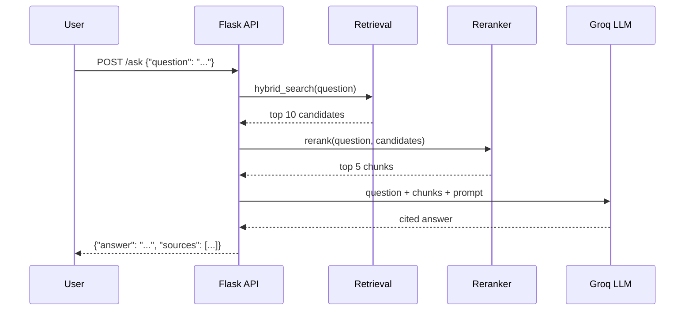

# Project 5 — System Architecture

## Full RAG Pipeline

```mermaid
flowchart TD
    A[User Question] --> B[Hybrid Retrieval]

    subgraph RETRIEVAL ["Script 03 — Hybrid Retrieval"]
        B --> C[Semantic Search\nBi-Encoder + ChromaDB]
        B --> D[Keyword Search\nBM25]
        C --> E[Reciprocal Rank Fusion\nCombine both result lists]
        D --> E
    end

    subgraph RERANK ["Script 04 — Re-ranking"]
        E --> F[Top 10 Candidates]
        F --> G[CrossEncoder\nReads query + chunk together]
        G --> H[Top 5 Chunks\nRe-scored by relevance]
    end

    subgraph GENERATION ["Script 05 — Generation"]
        H --> I[Build Prompt\nQuestion + chunks + instructions]
        I --> J[Groq LLM\nllama-3.1-8b-instant]
        J --> K[Cited Answer]
    end

    subgraph API ["app.py — Flask API"]
        L[POST /ask] --> A
        K --> M[JSON Response\nanswer + sources]
    end

    subgraph INDEXING ["Scripts 01 + 02 — Indexing\nRun once ahead of time"]
        N[21 Bird Documents\n.txt files] --> O[Chunking\nOverlapping 2000-char passages]
        O --> P[Embedding\nall-MiniLM-L6-v2]
        P --> Q[(ChromaDB\nVector Store)]
    end

    Q --> C
```

## Data Flow

```mermaid
sequenceDiagram
    participant User
    participant Flask API
    participant Retrieval
    participant Reranker
    participant Groq LLM

    User->>Flask API: POST /ask {"question": "..."}
    Flask API->>Retrieval: hybrid_search(question)
    Retrieval-->>Flask API: top 10 candidates
    Flask API->>Reranker: rerank(question, candidates)
    Reranker-->>Flask API: top 5 chunks
    Flask API->>Groq LLM: question + chunks + prompt
    Groq LLM-->>Flask API: cited answer
    Flask API-->>User: {"answer": "...", "sources": [...]}
```